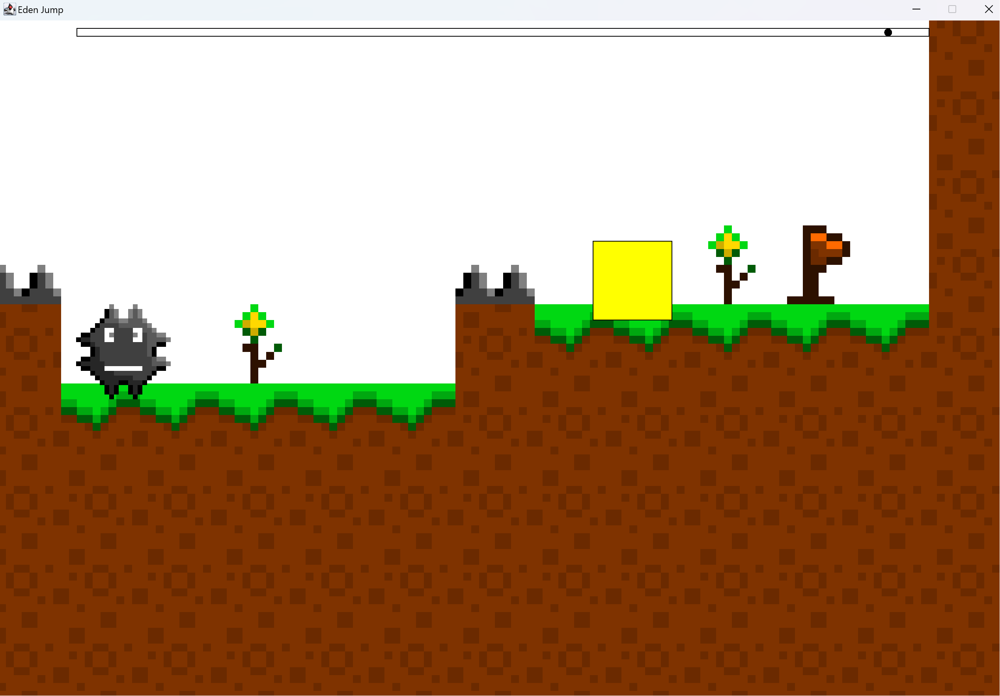
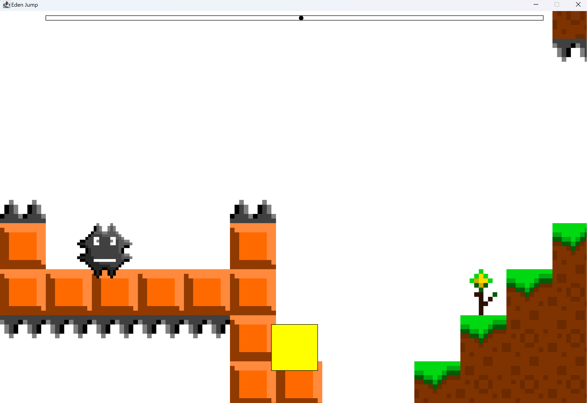
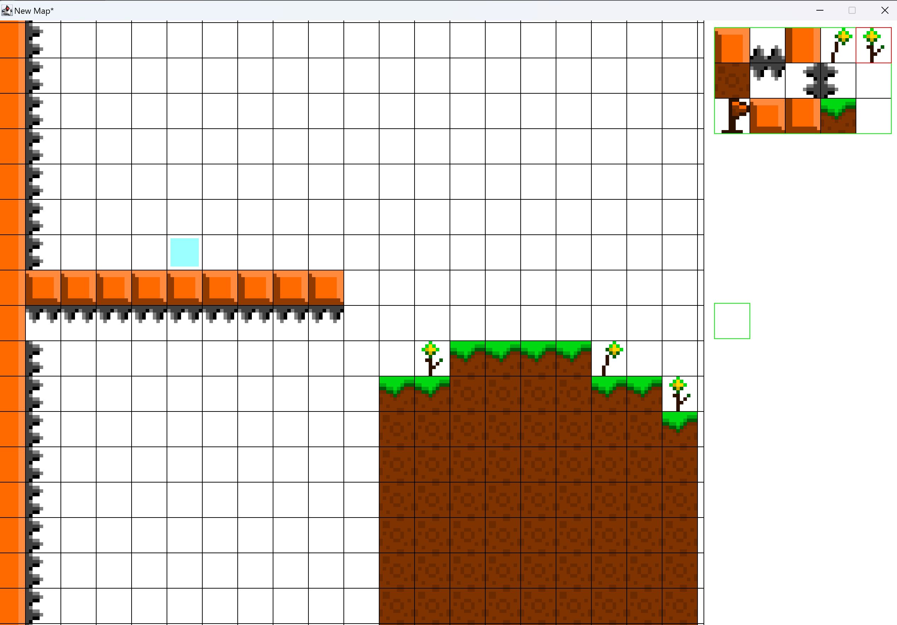

# Eden-Jump
ist ein 2D-Platformer Spiel. Das Ziel dieses Projekts war es die grundlegenden Spielmechaniken zu implementieren, d.h. Spielerbewegungen, Gravitation, Kollisionserkennungen und Gegner.

## Level
Die Level sind kachelbasiert aufgebaut. Bisher gibt es zwei kleine spielbare Testlevel.

   

## Mapeditor

  

